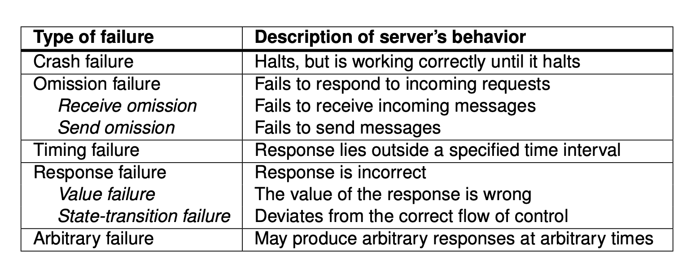

##### chapter1: What is a distributed system? (p.2)

-

##### chapter1: What are the two characteristics of a distributed system? (p.2)

chapter1: What four important goals should be met to make building a distributed system worth the effort? (p.7)
chapter1: What types of distribution transparency is there? (p.8)
chapter1: What is middleware in the context of distributed systems?
chapter1: What is an open distributed system and what can be done to achieve openness?
chapter1: What is scalability with regards to distributed systems and how can distributed systems be scaled?
chapter1: What are some pitfalls when designing distributed systems?
chapter1: What are some types of distributed systems?
chapter1: What is high performance distributed computing?
chapter1: What are distributed information systems?
chapter1: What is a pervasive system?
chapter2: what is an architectural style and how is it formulated?
chapter2: what are the three traditional layer views?
chapter2: What are an wrapper or adapter w.r.t. middleware? And how can these be organized?
chapter2: What are an interceptor? Fig 2.14.
chapter2: Describe an centralized system architecture. p.76
chapter2: In a client-server architecture, what does it mean that an operation is idempotent?
chapter2: How can a centralized system architecture be tiered? Give an example for each tier.
chapter2: Describe decentralized organisations (p2p systems)
chapter2: what is an structured peer-to-peer system?
chapter2: Describe an unstructured p2p system.
chapter2: Describe two ways of searching for specific data in an unstructured p2p system.
chapter2: What are policy-based search methods?
chapter2: What are Hierarchically organized p2p networks? Give an example of such network.
chapter2: What is an edge-server system?
chapter2: What is collaborative distributed systems?
chapter2: Describe NFS (Network File System).
chapter2: What are the 4 main architecture types?
chapter2: What are components, connectors and interfaces in system-architecture?
chapter2: Describe a layered system architecture.
chapter2: Describe a object-based system architecture.
chapter2: Describe a resource-based architecture.
chapter2: What is the difference between vertical and horizontal distributed achitectures?
chapter2: Describe a pub-sub architecture.
chapter2: What is a three-tiered client-server architecture?
chapter2: Not every node in a p2p network should become super-peer. What are reasonable requirements that a super-peer should meet?
chapter1: Why is it sometimes hard to hide the occurence of and recovery from a failure in a distributed system?
chapter2: What is coordination in a distributed system?
chapter2: Explain temporal and referential coupling.
chapter2: What are the four key characters in RESTful architectures
chapter2: Many people like RESTful approaches because the interface to a service is so simple. What is the catch about it?
chapter2: Can you give an example of a traditional three-layered architectural view?
chapter3: what is virtualization?
chapter3: explain software Process, Thread and Processor.
chapter3: explain context switching (w.rt Processor and Thread).
chapter3: How can a server be constructed?
chapter3: Give tree different levels of virtualization.
chapter3: Describe process, native and hosted virtual machines (monitor).
chapter3: What are privileged and nonpriviliged instrctions. Name the two special instructions.
chapter3: "for any conventional computer, a vmm may be constructd if the set of sensitive instr. for that computer is a subset of the set of privileged instr.". What is the problem with this and what are some solution?
chapter3: Distinguish application-level and middleware-level solutions. See figure 3.10 p.124
chapter3: Discuss benefits and disadvantages with a thin clients architecture for a distributed system
chapter3: Reasons to migrate code?
chapter3: Explain Push (code shipping) and Pull (code fetching) protocols in weak mobility
chapter3: What are the disadvantages and advantages of stateful servers?
chapter3: Is it possible to interrupt a server once it has accepted (or is in the process of accepting) a service request?
chapter3: Does connection-oriented communication fit into a stateless design?
chapter3:Having the first tier, in a three-tiered architecture handle all communication from/to the cluster may lead to a bottleneck. What could be a solution to this?
chapter3: Migration in heterogeneous systems can cause problems such as the target machine may not be suitable to execute the migrated code. And the definition of process/thread/processor context is highly dependent on local hardware, operating system, and runtime system. There's only one solution to this, what is it? (slides)
chapter3: X Window System designates a user's terminal as a hosting server, while the application is referred to as the client. Does this make sense? (past exam question)
chapter3: The X protocol suffers from scalability problems. How can these problems be tackled?
chapter4: What are the layers of the OSI-stack and what are the drawbacks of the OSI-model?
chapter4: What is the middleware layer?
chapter4: What types of communication do we have?
chapter4: What is an RPC?
chapter4: What are the basic steps of an RPC operation?
chapter4: What must be done to pass parameters in a RPC call and why must it be done?
chapter4: What is an asynchronous RPC and when is it useful?
chapter4: What is multicast RPC?
chapter4: How does message-oriented communication differ from RPCs?
chapter4: What is transient asynchronous communication?
chapter4: Briefly describe message-oriented persistent communication through message-oriented middle-ware.
chapter4: Why was the Advanced Message Queuing protocol created?
chapter5: What is naming used for in distributed systems?
chapter5: what is an access point?
chapter5: what does it mean when a name is location independent?
chapter5: Which properties does an identifier have?
chapter5: How can flat names be resolved?
chapter5: Explain DNS, how does this system lookup?
chapter5: Describe distributed hash table (Chord 😍😝).
chapter5: What is a hierarchical location scheme? Describe an approach to it.
chapter5: What are name spaces?
chapter5: How can name spaces be distributed?
chapter5: What are the principles of name resolution (recursive and iterative).
chapter5: What are Hilbert space-filling curves?
chapter6: In time synchronization, what are the differences between "The Berkeley Algorithm" and "The Time Network Protocol"?
chapter6: How can clocks be synchronized over a wireless network?
chapter6: How can tokens be used to elect super-peers in peer-to-peer networks?
chapter6: What is the main principle behind logical clocks (eg. Lamport Clocks)?
chapter6: Describe a decentralized system for mutual exclusion.
chapter5: What is an identifier and which properties does it have?
chapter5: What is a pure name?
chapter5: What is broadcasting?
chapter5: What is the Address resolution protocol (ARP)?
chapter5: What is meant by forwarding pointers?
chapter5: What are home-based approaches and when are they used?
chapter5: How can network proximity be exploited to get rid of problems like erratic message transfers?
chapter5: What is hierarchal location services (HLS)?
chapter5: How is lookup and insertion done in a HSL tree?
chapter5: How is scalability in an HLS and what can be done to scale such a system?
chapter5: What is structured naming?
chapter5: How do you resolve a name in a given name space?
chapter5: What is a closure mechanism?
chapter5: What is name linking and what forms of linking are there?
chapter5: What is mounting?
chapter5: How can a distributed name-space be implemented?
chapter5: What are the two methods of resolving a name and how are they done?
chapter5: What are some scalability issues in distributed name-spacing and what can be done to counter it?
chapter5: What is attribute-based naming?
chapter5: How can attribute-naming systems (directory services) be implemented?
chapter5: What is LDAP?
chapter5: What is a distributed index?
chapter6: How does a computer keep track of time?
chapter6: What is clock skew?
chapter6: What is UTC?
chapter6: What is the goal of clock synchronization and what types of synchronization do we have?
chapter6: What is clock drift?
chapter6: How can the network time protocol (NTP) be used to adjust time between two machines?
chapter6: How can the Berkeley algorithm be used to keep track of time without UTC?
chapter6: What is the reference broadcast system (RBS)?
chapter6: What is a happened-before relationship?
chapter6: What is a logical clock?
chapter6: Where should the logical clocks be implemented?
chapter6: How can Lamport’s logical clocks be used for mutual exclusion?
chapter6: What is a vector clock?
chapter6: How can causally ordered multicasting be done?
chapter6: What is mutual exclusion in a distributed system?
chapter6: What are two basic mutual exclusion techniques in distributed systems?
chapter6: How can permission-based schemes be implemented?
chapter6: What is Ricart’s and Agrawala’s distributed algorithm for mutual exclusion?
chapter6: How can a decentralized mutual exclusion algorithm be implemented?
chapter6: What isan election algorithm and what assumptions need to be made in an election algorithm?
chapter6: How does the bully algorithm work?
chapter6: How can election be done on a ring structure?
chapter6: What is the goal of election in wireless environments and how can election be done in such environments?
chapter6: What are locations system?
chapter6: How can position be calculated?
chapter6: How can Global positioning system (GPS) be used to find the position of a node?
chapter6: When cannot GPS be used to find a position and what alternatives do we have?
chapter6: How is positioning done in a centralized system?
chapter6: How can positioning be done in a decentralized system?
chapter6: What is event matching?
chapter6: How can event matching be done in a centralized manner?
chapter6: How can brokers route notifications to the appropriate set of subscribers?
chapter6: What is gossip-based coordination?
chapter6: What is aggregation?
chapter6: What is a peer-sampling service (PSS)?
chapter7: What are the reasons for replication in distributed systems?
chapter7: What is a consistency unit and what is it used for?
chapter7: What is the connection between sequential consistency and logical clocks?
chapter7: Describe the underlying principle of causal consistency.
chapter7: What are the differences between "Monotonic read/write" consistency and "Read your writes" consistency?  
chapter7: What does replica placement involve?
chapter7: What are the three main ways of doing content replication?
chapter7: What are the three ways content can be propagated to replica servers?
chapter7: What is the difference between a push-based and a pull-based data transfer scheme?
chapter7: What is a lease and how can lease expiration time be decided?
chapter7: When should multicasting and unicasting be used with regards to push and pull protocols?
chapter7: What is a consistency protocol?
chapter7: How can the three ranges of continuous consistency be implemented?
chapter7: What are primary based consistency protocols?
chapter7: What kind of primary based consistency protocols do we have?
chapter7: What is replicated-write protocols?
chapter7: How can client-centric consistency be implemented?

##### chapter8: Being Fault tolerant are related to being a dependable system. What does Dependability mean in this context? Give the four properties of Dependability. (p.463)

- _Ans:_ Dependability utilises these four properties
  1. Reliability: the system is reliable and works as the should continuesouly
  2. Avalability: the system is available for the user at once
  3. Safety: If the system fails, the entire system does not crash
  4. Maintainability: The system can be fixed after a crash.

##### chapter8: Fail, error and fault is three ways a system can lead to failure. Describe these properties. (p.465)

- _Ans:_
  - Failure: Refers to the fact that the system does not work as expected.
  - Error: Is a state that can lead to failure in the system
  - Fault: Is the result of an error

##### chapter8: Which types of failures can a system have? (p.467)

- _Ans:_ Crash failure, omission (send and receive), timing, response (value and state transfer), byzantine.

  

###### chapter8: How can a fault tolerant system hide the occurrence of failures from other processes using redundancy?(p.472)

- _Ans:_ There are three main ways a system can hide occurences of failures in a system.
  1. Time redundancy: Utilises the fact that a transaction can be retransmitted such that all failures can be hidden.
  2. Information redundancy: Added extra bits of information such that the system can roll back in case of failures. Hamming code is an example
  3. Physical redundancy: Add extra processes or hardware such that the system as a whole can handle the failures.

##### chapter8: How can resilience be done using process groups? Describe process groups, and their internal structure.(p.473)

- _Ans:_ Processes can be resiliente using groups and there are often two distinct groups:

1. Flat group: There are no hiearchy in the group and every process is just as important as the other. An example is a peer-to-peer system
2. Hiearchical group: Is an organization where there are a leader/organizer that handles the incomming request. The coordinator is responisble for handing out work for the correct process. An example is the domain name system (DNS)

##### chapter8: Process resilience with grouping needs to be managed in some way. Give how the management protocols can be implemented.(p.474-475)

- _Ans:_ You have two main protocols:

1. **Primary-based replication**, commonly seen in **primary-backup protocols**, arranges processes hierarchically, designating a primary process to coordinate all write operations. Although the primary's role is fixed, backups can take over if the primary fails, initiated through an election algorithm. This protocol ensures a continuity of operations even after primary failure, enhancing fault tolerance.

2. **Replicated-write protocols**, such as **_active replication_** and **_quorum-based protocols_**, organize identical processes into flat groups where multiple processes handle write operations concurrently. While eliminating single points of failure, this approach requires distributed coordination, offering resilience at the expense of increased complexity.

##### chapter8: Process grouping is a part of the solution for building fail-tolerant. How should process in these groups be replicated? (p.474-475)

- _Ans:_ Process grouping, vital for fail-tolerant systems, relies on effective process replication within these groups. Replication strategies include primary-based protocols, where a designated primary manages operations with backups ready to take over if needed. Alternatively, replicated-write protocols distribute write operations among identical processes in a flat structure. Determining the level of replication depends on the nature of failures. For silent failures, k + 1 processes provide k-fault tolerance, while for arbitrary failures, 2k + 1 processes are needed. The key lies in ensuring majority agreement among remaining processes to maintain system integrity despite failures.

##### chapter8: What is meant when a system is k-fault tolerant?(p.475)

- _Ans:_ A system being k-fault tolerant means it can sustain the failure of up to k components or processes while still functioning within its specified parameters or meeting its intended objectives. This concept refers to the system's ability to continue operating despite k failures within its components, ensuring reliability up to a predefined fault threshold. The value of 'k' determines the system's resilience to faults, whether they're silent failures, where components stop working without signaling an error, or arbitrary failures, where components continue but may produce erroneous results.

##### chapter8: What is meant by reaching consensus in a fail-tolerant system? Describe approaches to reach consensus.

- _Ans:_ In a fail-tolerant system, reaching consensus among processes is crucial. It means that nonfaulty processes within a group must agree on which command to execute, despite the possibility of failures. One approach, flooding-based consensus, operates in rounds where each process shares its list of proposed commands. They then merge these lists to select a command, assuming no failures. However, if a process crashes during this process, discrepancies arise. For instance, if a process receives commands from a crashed process while others don't, decisions are delayed until the next round. Ultimately, processes decide based on received commands. Despite potential lost or delayed decisions due to crashes, the algorithm ensures that, with reliable failure detection, at most one nonfaulty process remains, capable of making the final decision, ensuring eventual consensus.
  Other algorithms such as _Raft_ and _Paxos_ can also be utilised to achieve consensus. **TODO:** Describe _Raft_ and _Paxos_

##### chapter8: How can a system detect failures? (p.505-507)

- _Ans:_ In distributed systems, detecting failures is essential for fault tolerance. Processes can detect failures either by actively sending 'are you alive?' messages and expecting responses or by passively waiting for messages. Typically, a timeout mechanism is employed: if a process doesn't respond within a set time, it's suspected to have crashed. However, this method faces challenges in unreliable networks, leading to false positives. Various strategies like gossip-based detection or exchanging information among nodes aim to tackle these issues. Systems ideally should distinguish between network and node failures and efficiently inform nonfaulty processes about detected failures.

##### chapter8: What are the five different classes of failures that can occur in rpc systems, and how can these be solved? (p.508-515)

- _Ans:_

  1. Client Unable to Locate Server: This can happen if servers are down or if there's a version mismatch between the client and server interfaces. Handling this might involve exception handling or signal mechanisms.

  2. Lost Request Messages: Using timers to resend requests in case of lost messages is a common strategy. However, distinguishing between lost requests and server unavailability can pose challenges.

  3. Server Crashes: Differentiating between server crashes after processing requests (requiring reissue) and crashes before execution (where retransmission might suffice) is challenging. Strategies like at-least-once, at-most-once, or non-deterministic semantics are adopted but have limitations in ensuring exact-once semantics.

  4. Lost Reply Messages: Employing timers again to resend requests if replies are not received within a certain time frame. However, distinguishing between lost replies and slow servers can be difficult.

  5. Client Crashes: Handling orphan computations caused by client crashes can be complex. Strategies like orphan extermination, reincarnation, gentle reincarnation, and expiration have been proposed. However, these methods are crude and can have unforeseen consequences, such as lingering locks or queued processes.

##### chapter8: What is reliable group communication? (p.515-517)

- _Ans:_ Reliable group communication ensures that a message sent to a process group is delivered to every member of that group. It involves separating the receipt of messages from their delivery, ensuring messages are reliably delivered to all non-faulty group members. Achieving this involves managing the distinction between consensus on group membership and reliable message delivery, typically done using reliable transport protocols and acknowledgment mechanisms. Strategies might include sequence numbering messages, storing them locally until acknowledged by all receivers, and retransmitting in case of missing acknowledgments. Trade-offs exist between message count and transmission efficiency, often addressed through various approaches outlined in research and discussions on reliable multicasting.

##### chapter8: What is a distributed commit? Mention the three protocols in distributed commit.

- _Ans:_ The distributed commit involves having an operation being performed by each member of a process group, or none at all. The three protocols: One-phase commit, two-phase commit and three-phase commit.

##### chapter8: Explain the protocols, one-phase commit protocol, two-phase commit protocol and three-phase commit protocol.

- _Ans:_

1. 1PC: Single coordinator responsible for managing transaction. Coordinator sends a commit request to all participants. if all ack commit request, coordinator assumes that the transaction is succsess and sends a global commit to all cohorts, if any cohorts fail to ack the commit request or if failure, the transaction is aborted.
2. 2PC: Prepare phase, commit or abort phase. Send prepare, cohorts reply with yes or no, (they do not commit yet), based on results from prepare phase cooridantor sends global commit to all cohorts to make them commit. If any cohort reply "no" a abort message is broadcasted to all cohorts.
3. 3PC: Handles error from 2PC where coordinator crashes after prepare phase is done. Prepare, pre-commit, commit or abort. Adds the pre-commit phase where cohorts receive the intent to commit but do not commit yet. If the coordinator receives ack from all on intent message it commits and broadcasts.

##### chapter8: What is forward error recovery?

- _Ans:_ Forward to a new correct state instead of rolling back to a previous checkpoint.

##### chapter8: What is backward error recovery?

- _Ans:_ Bring the system from an error state, back to a state where the system worked correctly.

##### chapter8: What is message logging?

- _Ans:_ Takes a log of all messages being sent and recieved before sending them. This is usually in combination with checkpointing.

##### chapter8: What is a distributed snapshot?

- _Ans:_ A distributed snapshot is a state from the entire system. This will include sending, recieving and local storage for each process in the system.

##### chapter8: What is Independent checkpointing?

- _Ans:_ As processes take local checkpoints independent of each other, this method is also referred to as independent checkpointing. Its implementation requires that dependencies are recorded in such a way that processes can jointly roll back to a consistent global state.

##### chapter8: What is an orphan process?

- _Ans:_ A process with no "parent", process A sends request to B, then process A crashes, and eventually recovers, process A is then orphan.

##### chapter9: How can one control access to an object? Describe the general model, as well as some approaches of implementing a reference monitor.

##### chapter9: what are some approaches to protect against malicious code?

##### chapter9: the use of ACL or cryptography is fine when working with communicating parties which has the same rules. How can one protect resources wher communication is not just done in a isolated network?

##### chapter9: What are the three issues we need to worry about when a client retrieves an object based on some name? and how can secure naming be solved?

##### chapter9: Describe the three main focus levels in computer security design.

##### chapter9: What is a systems trusted computing base?

##### chapter9: Describe how a public-key cryptosystem can be used to ensure confidential group communication.

##### chapter9: Why are session keys used?

##### chapter9: What is Kerberos and how does it work?

##### chapter9: How do firewalls work and what are the two main "levels" of a firewall?

##### chapter9: What is a DDoS attack and how can it be prevented?
